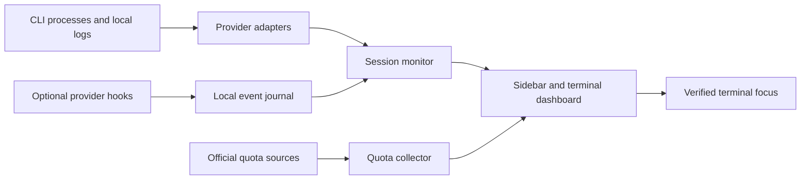

# Architecture

## Data flow

Provider adapters read local session metadata.
The monitor joins that metadata with live process evidence and events.
The quota collector and session monitor use different workers.
The interface receives copied session snapshots.

## Module boundaries

| Module | Responsibility |
|---|---|
| `agents/base.py` | Session, runtime, and quota models |
| `agents/*.py` | Provider session adapters |
| `agents/quota.py` | Quota requests, freshness, and account cache keys |
| `core/monitor.py` | Session association and event application |
| `core/events.py` | Event journal and state reduction |
| `core/logevents.py` | Bounded incremental log reads |
| `core/terminals.py` | Verified focus and explicit terminal launch |
| `core/console_identity.py` | Temporary console title check |
| `core/runtime.py` | Source and frozen helper commands |
| `core/startup.py` | Current user start at sign-in setting |
| `core/integrations.py` | Hook installation and removal |
| `ui/sidebar.py` | Desktop widgets and action dispatch |
| `ui/dashboard.py` | Terminal display and keyboard controls |

## Invariants

The session key contains the CLI, data home, and native session ID.
Runtime identity also contains process creation time.
Only direct process and file evidence can show an open session.
Only explicit events can show a completed turn or a wait state.
Only a verified native terminal target can produce a focus success result.
Quota failure does not block session discovery.
The interface does not mutate the collector's session objects.

## Windows package

The package has a windowed sidebar EXE and a console EXE.
Both EXE files use the same library directory.
The console EXE also runs a fixed set of internal helpers.
An unknown helper name causes the command to stop.
External CLIs receive their provider environment without package loader paths.
Qt libraries stay different DLL files.
